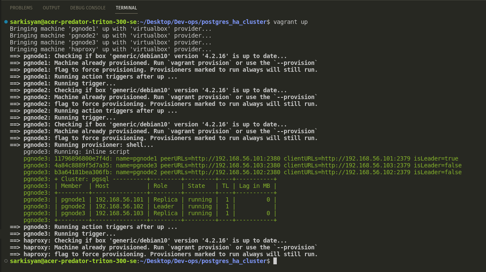
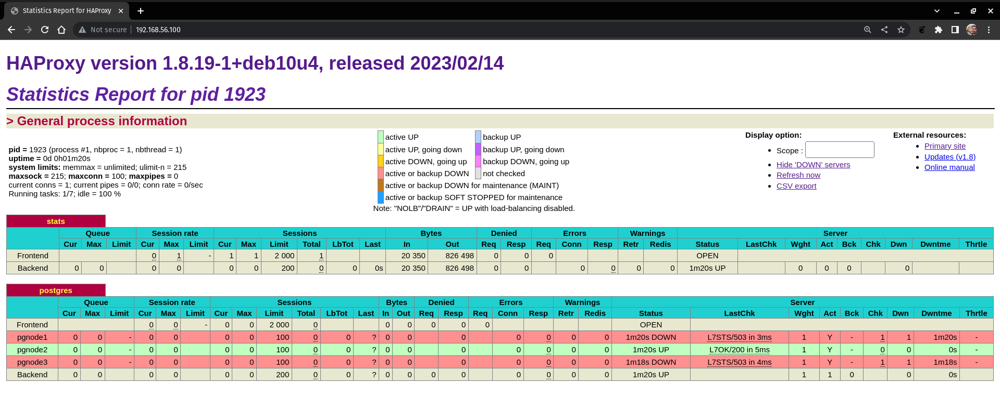
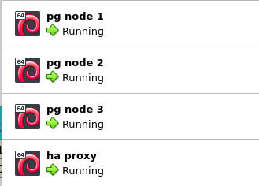

# Pre-requirement

*Third-party software*
* Oracle VM VirtualBox
* Vagrant by HashiCorp
* Node.js (only for DB stress tests)

# Deployment

* Start deployment with `vagrant up` command
* If you would like to save deployment log use `vagrant up 2>&1 | tee cluster_deploy_`date +%d-%m-%Y"_"%H_%M_%S`.log` command

# Vagrant file params

* `HA_PROXY_RAM = 1024`
* `HA_PROXY_CPU = 1`
* `DB_NODE_RAM = 2048`
* `DB_NODE_CPU = 2`
* `VM_BOX = "generic/debian10"` (tested only on debian10)
* `HA_PROXY_IP = "192.168.56.100"`
* `MASTER_IP = "192.168.56.101"`
* `SLAVE_1_IP = "192.168.56.102"`
* `SLAVE_2_IP = "192.168.56.103"`
* `POSTGRES_PASSWORD = "qwerty12"`
* `ETCD_CLUSTER_TOKEN = "etcdtesttoken"`

# Simple database stress test

* execute 'npm i' from `db_test_js` folder to install node modules (pg and dotenv)
* create `.env` file in `db_test_js` folder
* execute `node -r dotenv/config testScript.js` command from `db_test_js` folder

# .env params 

* `DB_USER=postgres`
* `DB_PASSWORD=qwerty12`
* `DB_NAME=postgres`
* `DB_HOST=192.168.56.100`
* `DB_PORT=5432`
* `COMMAND_INTERVAL=100`

# Screenshots

